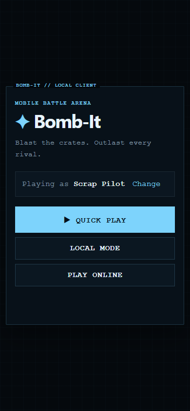
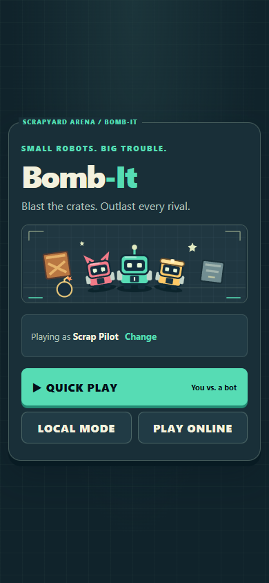
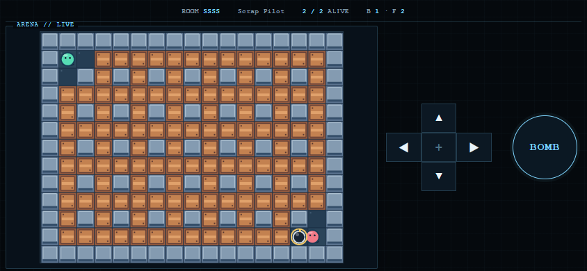
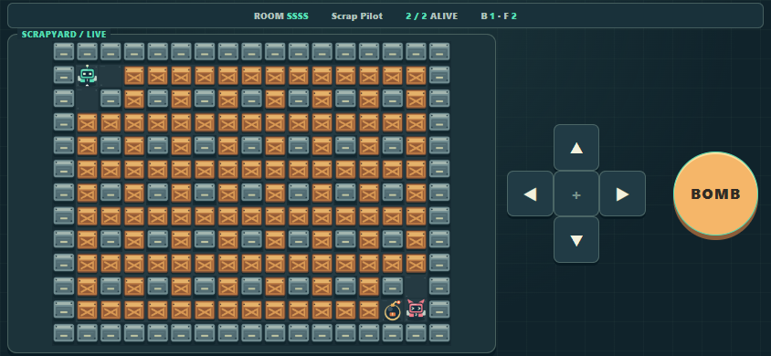
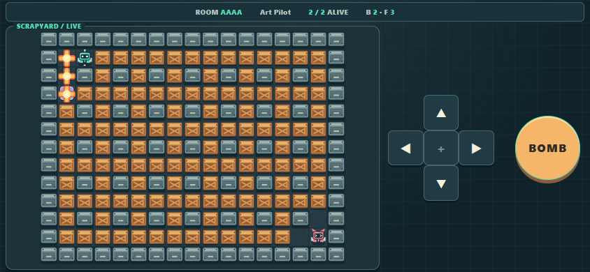

# Scrapyard visual refresh

Review branch: `codex/scrapyard-visual`. Baseline: `3f33845338818a32f3691273c0094ef76872b8ae`.

[Playable isolated preview](https://wzzzodiac.github.io/Bomb-It-Preview/) · [Preview repository](https://github.com/wzzzodiac/Bomb-It-Preview).

Production Bomb-It and Bomb-It-Server are unchanged. The preview is a separate free GitHub Pages repository under the already accepted `https://wzzzodiac.github.io` origin, using the existing compatible backend. No backend deployment, credentials, new infrastructure or paid assets were required. Do not merge/publish the game until visual approval.

## Direction and scope

Six original scrap robots replace the circles, distinguished by colour, head silhouette and chest number. Reinforced crates, riveted metal walls, warning bombs, high-contrast flame cells and two power-up symbols share a workshop palette with home/profile, both lobbies and results. The local player has a small white marker.

The SVG home illustration and 14-frame Canvas atlas are original code-authored artwork, not third-party assets. Existing music is reused unchanged; no new licences/dependencies. Atlas: 512×128 RGBA, approximately 256 KiB raw pixel storage, generated once per game texture manager. Each tile is now one batched image instead of a base rectangle plus a container of vector details. No tile text, particle systems, blur filters, shaders or continuous idle animations. Decorative bomb scale pulses respect reduced-motion. Flames remain at least 80% opaque throughout the existing authoritative lifetime and disappear at its end.

No arena generation, map dimensions, collision, player/bot rules, fuse/damage/drop timings, prediction, session protocol or server files were changed. The three exact map ratios (17:13, 21:17, 25:19) remain. The narrow-landscape fit now uses both container dimensions; it no longer fixes height while constraining width. D-pad targets are 48 px high by default, 52 px in narrow portrait and 44–52 px square in short landscape. Existing pointer/keyboard handlers, BOMB sizing and safe-area behaviour remain.

Phaser/game rendering is deferred until local start, or loaded **before online room membership** to keep subsequent match events synchronous. Repeated local starts are guarded; leaving the starting screen cancels that pending local start. A download failure leaves the menu available and asks for reload.

## Before and after

Same viewports and seeded layout for the paired captures; screenshots were opened and inspected. These are Edge emulation, not photographs of a phone.

| Before | After |
| --- | --- |
|  |  |
|  |  |

## Download and performance measurements

Edge **154.0.4258.62**, headless on the installed desktop; cold independent contexts, disabled cache, local static serving with gzip HTML/JS/CSS, 1.6 Mbps download, 750 Kbps upload, 150 ms latency, no CPU throttle. Same Quick Play input and deterministic RNG in both builds. Screenshots occur between home-ready and start; therefore navigation-to-canvas includes screenshot overhead. One run per viewport is a sample, not a statistical benchmark or production CDN measurement. Decimal bytes/MB below.

| Metric | Before | After |
| --- | ---: | ---: |
| Unique first-round files, uncompressed (including entire existing MP3) | 2,367,278 B | 2,378,336 B |
| Same unique resources: gzip text + entire MP3, excluding HTTP headers | 1,421,441 B | 1,425,697 B |
| Home completed-request transfer, including HTTP overhead | 362,980 B | 27,970 B |
| Home ready, 390×844 | 2,289 ms | 539 ms |
| First canvas since navigation, 390×844 | 2,432 ms | 2,959 ms |
| Click-to-first-canvas, 390×844 | 121 ms | 2,389 ms |
| Received compressed bodies through first canvas + 1 s, 390×844 | 515,042 B | 622,911 B |
| Browser RAF sampling during first second, 390×844 | 120.6 fps | 120.3 fps |

The unique compressed first-round resource increase is **4,256 B**, comfortably below the **3 MB additional** allowance. Home transfer falls about 92%. This does **not** make a cold first match faster: the deferred engine adds a download on click and the measured navigation-to-game time increases about 0.53 s. Repeat starts reuse the engine. The entire music file is included in the conservative unique-resource total but is not a prerequisite for play. Actual music transfer is streamed and can have two media requests because the existing crossfade uses two audio elements; cache-disabled transfer snapshots include partial/in-flight audio and are **not** the complete-download total. No required external match art/fonts; the previous external avatar favicon was replaced with inline original art.

Final visual stress fixture: 48 flame cells every 500 ms for 5 s at 844×390. Phaser reported 112.3 fps on the high-refresh desktop host; browser RAF 120.1 fps, p95 frame 8.4 ms, 0 frames over 33.4 ms. This is useful desktop regression evidence, **not mobile GPU/thermal/battery performance**. No physical reference phone was available. Sustained 60/30 fps on a real phone remains unverified; no Safari/Firefox coverage is claimed.

Raw evidence: [before](visual-refresh/before.json), [after](visual-refresh/after.json), [visual fixtures](visual-refresh/fixtures.json), [development smoke](visual-refresh/smoke.json), [live preview smoke](visual-refresh/preview-smoke.json).

## Verification

- `npm test`: **29/29 pass** (27 existing tests plus tile semantics and bounded/cached atlas tests).
- `npm run typecheck`: pass. `npm run build`: pass; the existing large-engine chunk warning remains (~339 KB gzip).
- Browser smoke: 1920×1080, 1366×768, 390×844, 844×390, 667×375, 320×568. All three logical arena presets checked: full map visible, aspect ratio correct, no active-match page scroll, no control overlap. Representative captures of desktop, narrow portrait, large-map landscape and results inspected.
- Profile submit, home and local lobby, bots moving, keyboard movement/bombs, pointer movement/bombs, death/results and local replay pass. Test-only instrumentation pauses bots after checking movement to make subsequent assertions deterministic; synthetic pointer events are not real thumbs.
- Two browser clients against the unchanged local authoritative server: duplicate nicknames have distinct membership IDs; movement/bombs replicate; explosions/deaths/results and same-room reset pass.
- Deterministic visual fixtures: both power-ups render/collect, crate becomes floor with drop, escape survives, damaging flames disappear on time, reduced-motion pulse suppression and reload recovery after interrupted engine download pass.
- **Live preview** HTTP 200, two clients on the existing backend, online bot add/remove, desktop/mobile rendering, move/bomb, explosion/death/results and same-room reset pass. No runtime errors or unexpected network failures. MP3 `ERR_ABORTED` entries are recorded separately as expected cancellations when leaving/finishing playback.
- Final source/generated diff and staged file list reviewed for credentials/private local paths; no sensitive files intended for commit. Local toolkit instruction updates preserved outside this PR; server worktree remains clean at its original commit.

## Environment and reproduction

Local canonical toolkit is clean at `41b870aa9acc536681165593efc3ae2062031b8b`, version 0.7.1; fetch/diff confirms it matches `wzzzodiac/Codex` main 1:1. Project-local user updates were not overwritten or included. Selected skills: project-workflow, coding-standards, frontend-patterns and verification-lite; E2E guidance was read from the canonical local toolkit. No skills/MCPs/agents were installed or changed.

Node/npm and Playwright with installed Edge were operational. Blender 5.2 has a local installation directory but was not run; Godot/gh were not found on PATH. Inventor installations are unrelated to this 2D rendering task. Blender/Godot/CAD were not needed: original Canvas/SVG assets avoid a render pipeline and download weight.

See README for the existing-runtime setup for `scripts/visual-smoke.mjs`. `scripts/visual-fixtures.mjs` uses the same local frontend/backend setup. `scripts/visual-measure.mjs [built-root] [label]` starts a temporary gzip static server on 5188 and writes screenshots/JSON to ignored `outputs/visual-qa/`; use the baseline commit's `index.html`/`assets` exported into a separate directory for before measurements. Set `PLAYWRIGHT_MODULE` to an already installed package and optionally `EDGE_EXECUTABLE`; scripts never install a browser. The measure server is for local QA only, not deployment.

For a separate preview build: `npx vite build --base=/Bomb-It-Preview/ --outDir=<separate-output-directory>`, then publish its generated `app/index.html` as root `index.html` and its `assets` to the isolated preview repository. Do not change production Pages settings or backend origin checks.
